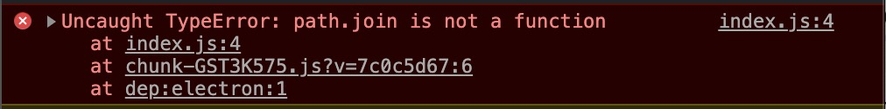
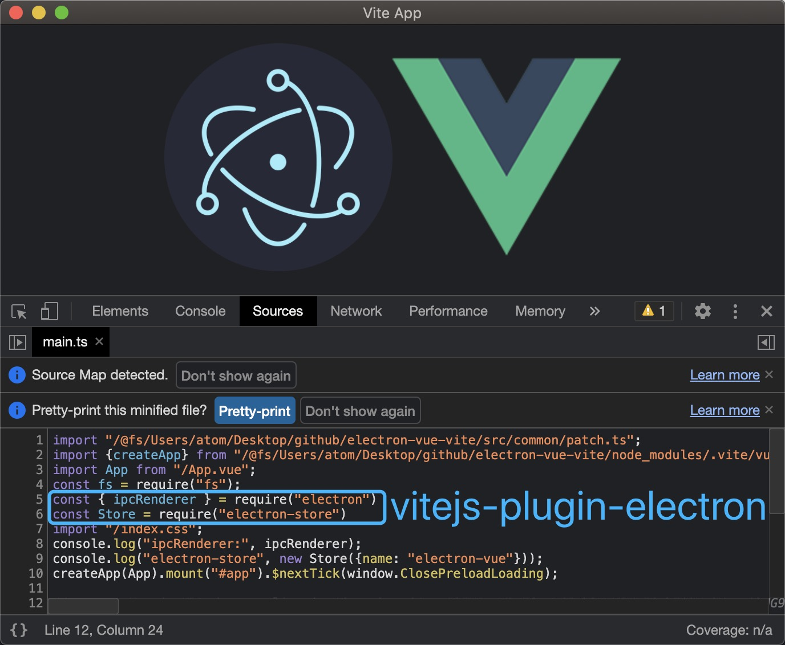

# Vite 整合 Electron 总结

## 前言

- Vite 是面向未来几年的构建工具，很有必要在各个场景下都试试集成进来
- Electron 作为前端标配的桌面开发工具，官方并有脚手架也没和哪个框架整合
- `@vue/cli` 官方有给出模板；但是 Vite 这块并没提供，毕竟人家定位是和 `webpack` 那样的通用构建工具
  甚至连 Vue 都没集成 🖖 那么我们尝试来做下这件事儿
  按照 Vue 在 Vite 中的集成风格 Electron 这块应当写一个插件！

## 注意 📢
- 这里假定你简单的知道一些 Vite 的工作原理，这种文章网上有好多的
- 同时也假定你使用或者上手过 Electron；上手非常简单，直接看官网即可
- 项目整体所有代码在这 [https://github.com/caoxiemeihao/electron-vue-vite](https://github.com/caoxiemeihao/electron-vue-vite) 可以直接 **用于生产** (亲点个 start 呗 😘)

## 目录结构设计

```tree
·
├── script           项目脚本目录
├── src
|  ├── main          Electron 主进程代码
|  ├── preload       Electron 预加载目录
|  ├── render        Electron 渲染进程 - 既 Vite 代码
|
├── vite.config.ts   Vite 配置文件
```

## vite.config.ts 配置

- Electron 支持全量的 NodeJs API 渲染进程难免会用到
- Vite 基于的 Rollup 构建工程，所以我们改造 Rollup 部分配置，输出 CommonJs 格式
- 目录结构相比于 Vite 提供的默认结构有所不同，也需要配置一番才能按预期工作

```ts
import { defineConfig } from 'vite'
import vue from '@vitejs/plugin-vue'
import { join } from 'path'

export default defineConfig((env) => ({
    plugins: [
      vue(), // 开启 Vue 支持
    ],
    root: join(__dirname, 'src/render'), // 指向渲染进程目录
    base: './', // index.html 中静态资源加载位置
    build: {
      outDir: join(__dirname, 'dist/render'),
      assetsDir: '', // 相对路径 加载问题
      rollupOptions: {
        output: {
          format: 'cjs', // 配置 Rollup 打包输出 CommonJs 格式
        },
        external: ['electron'], // 告诉 Rollup 不要去打包 electron
      },
    },
    optimizeDeps: {
      exclude: ['electron'], // 告诉 Vite 不要转换 electron 模块
    },
  // 其他配置略...
}))
```

## 启动脚本分析

- 我们先出个结论 - Electron 的启动与 NodeJs 相比行为几乎是一致的 - `可执行程序` + `入口文件`

```shell
# 全局目录安装的 NodeJs
node path/filename.js

# 项目目录安装的 Electron
node_modules/.bin/electron path/filename.js
```
- 如果我们把 Electron 的启动设计到 `npm` 的 `scripts` 中，它还可以更简单 `npm run electron`

```json
{
  "scripts": {
    "electron": "electron path/filename.js"
  }
}
```
- 🤔 思考一下，`npm` 只有一个启动命令 Vite、Electron 各需要一个，加一起就是两个启动命令了这里我们借助 `concurrently` 来同时启动 Vite、Electron

```json
{
  "scripts": {
    "dev": "concurrently \"npm run vite\" \"npm run electron\"",
    "vite": "vite",
    "electron": "electron path/filename.js"
  }
}
```
**看起来不错！**

- 不过我们再思考下关于 Electron 启动的问题
  1. 开发环境下 Electron 应该加载 Vite 启动的开发服务器，生产环境下启动一个具体的文件
  2. 那么这里就会出现一个等待的情况，就是 Electron 要等待 Vite 启动后再启动

## 启动脚本设计

- 我们需要监听 Vite 的启动后拉起 Electron，这块我们考虑用轮训监听端口的方式
- 监听到 Vite 启动后 Electron 我们用 NodeJs 的子进程 API `child_process.spawn()` 拉起
- 我们将 `npm scripts` 做下改动，方便我们知道脚本是干啥的，**相对上面的脚本这里重命名一下**
  `concurrently` 也加入一些命令行参数，能得好更友好的控制台输出

```json
{
  "scripts": {
    "dev": "concurrently -n=vue,ele -c=green,blue \"npm run dev:vue\" \"npm run dev:ele\"",
    "dev:vite": "vite",
    "dev:electron": "node -r ts-node/register script/build-main --env=development --watch"
  }
}
```

- 由于我们要控制的是 Electron 的启动，为此我们单独写个脚本(script/build-main.ts)来控制，包括下面两个功能点
  1. 启动时机控制 - 监听 Vite 已经启动
  2. 主进程代码使用使用 typescript 开发 - 加入 Rollup 编译、打包

#### script/build-main.ts

```ts
import { join } from 'path'
import { get } from 'http'
import { spawn, ChildProcess } from 'child_process'
import { watch } from 'rollup'
import minimist from 'minimist'
import electron from 'electron'
import options from './rollup.config'
import { main } from '../package.json'

/**
 * 1. 监听 vite 启动
 */
function waitOn(arg0: { port: string | number; interval?: number; }) {
  return new Promise(resolve => {
    const { port, interval = 149 } = arg0
    const url = `http://localhost:${port}`

    // 通过定时器轮训向 Vite 服务器请求
    const timer: NodeJS.Timer = setInterval(() => {
      get(
        `http://localhost:${port}`, // 指向 Vite 开发服务器
        res => {
          clearInterval(timer)
          resolve(res.statusCode)
        }
      )
    }, interval)
  })
}

/**
 * 2. 控制 Electron 启动时机，编译 typescript
 */
waitOn({ port: '3000' }).then(msg => {
  // 解析 npm script 的命令行参数
  const argv = minimist(process.argv.slice(2))
  
  // 加载 rollup 配置
  const opts = options(argv.env)

  // Vite 启动后以监听模式开启 Rollup 编译 Electron 主进程代码
  const watcher = watch(opts)

  let child: ChildProcess

  watcher.on('event', ev => {
    if (ev.code === 'END') {
      // 保证只启动一个 Electron 个程序
      if (child) child.kill()

      // 使用 NodeJs 子进程能力拉起 Electron 程序
      child = spawn(
        // 这里 electron 本质上只是一个字符串；指向 Electron 可执行程序的绝对路径
        electron as any,

        // 指定 Electron 主进程入口文件；既 Rollup 编译后输出文件的路径
        [join(__dirname, `../${main}`)], { stdio: 'inherit' }
      )
    }
  })
})

```

#### script/rollup.config

```ts
import { builtinModules } from 'module'
import { join } from 'path'
import { RollupOptions } from 'rollup'
import nodeResolve from '@rollup/plugin-node-resolve'
import commonjs from '@rollup/plugin-commonjs'
import typescript from '@rollup/plugin-typescript'
import json from '@rollup/plugin-json'

/** node.js builtins module */
const builtins = () => builtinModules.filter(x => !/^_|^(internal|v8|node-inspect)\/|\//.test(x))

export default (env = 'production') => {
  const options: RollupOptions = {
    input: join(__dirname, '../src/main/index.ts'),
    output: {
      file: join(__dirname, '../dist/main/index.js'),
      format: 'cjs', // 使用 CommonJs 模块化
    },
    plugins: [
      nodeResolve(), // 支持 node_modules 下面的包查找
      commonjs(), // 支持 CommonJs 模块
      json(), // 支持引入 json 文件
      typescript({
        module: 'ESNext', // 支持 typescript
      }),
    ],
    external: [
      // 打包避开内置模块
      ...builtins(),
      'electron',
    ],
  }

  return options
}
```

**到这为止，项目应该是能跑起来的状态了；但是还不能使用 Electron、NodeJs 相关的 API**

> 这里简单的改了下 App.vue、HelloWorld.vue 中的一些文案，没做逻辑修改；就不贴出代码了


## 加入 Electron API

- 渲染和主进程通信是个十分常用的功能；我试着从 `electron` 导出 `ipcRenderer`

```ts
// src/render/main.ts
import { createApp } from 'vue'
import App from './App.vue'
import { ipcRenderer } from 'electron'

console.log('ipcRenderer:', ipcRenderer)

createApp(App).mount('#app')
```



- **报错了！默认情况下直接用 import 语法会被 Rollup 编译**
- 事实上在 `'electron'` 在 Electron 运行环境中是一个 **内置模块** 你可以在控制台中试试下这段代码

> *注意这里先不要引入 Electron 相关的包，保障项目能跑起来*

```js
require.resolve('electron')
"electron" // 将会输出
```

- 既然 Electron 本就支持全量的 NodeJs API 我们不妨直接在在代码中直接写成

```diff
// src/render/main.ts
import { createApp } from 'vue'
import App from './App.vue'
- import { ipcRenderer } from 'electron'
+ const { ipcRenderer } = require('electron')

console.log('ipcRenderer:', ipcRenderer)

createApp(App).mount('#app')
```

**项目确实跑起来了，我们还可以用这个办法进一步验证其他的模块**


## 插件设计分析

- 可以打包票说，这个可以用！(仅限开发期)；但是这个会带来两个问题
  1. 编码风格不统一，人家都在用 `ESModule` 混入 `CommonJs` 确实不好看
  2. `require('xxxx')` 在打包期间如果不做些处理，并不会被 Rollup 处理 (这里只`.ts`文件,有大神知道怎么对付这种情况的请指点下小弟)
    如果你引入的是 `node_modules` 中的包那可就惨了；比如 `require('electron-store')` 这种会原样输出；打包后的程序开起来会找不到 `'electron-store'` 这个模块，铁定报错！

- 我们知道 `ESModule` 写法在开发期运行会报错，但是还是要写；
如果我们在运行的前一刻将 ESModule 转换成 NodeJs 内置的 CommonJs 岂不是两全其美的好事；
甚至只要有关 NodeJs API 的包我们都可以转化，毕竟开发期项目根目录是有 `node_modules` 这个 **NodeJs包仓库** 给你用的！

**分析至此，我们该动动手写个插件了；让插件去自动化完成 - ESModule to CommonJs**

## vitejs-plugin-electron

- Vite 插件上手教程请看官网 [https://vitejs.dev/guide/api-plugin.html](https://vitejs.dev/guide/api-plugin.html) (我个人觉得比 `webpack` 那边的插件要好写)
- 为了支持传参方便日后扩展，我们把它成一个 Function 并返回一个插件
- 代码处理这块，我们需要一个 AST 工具帮忙 - `yarn add acorn` 

```ts
import * as acorn from 'acorn'
import { Plugin as VitePlugin } from 'vite'

const extensions = ['.js', '.jsx', '.ts', '.tsx', '.vue'] // 需要处理的文件后缀

export interface Esm2cjsOptions {
  excludes?: string[] // 需要被转换的模块
}

export default function esm2cjs(options?: Esm2cjsOptions): VitePlugin {
  const opts: Esm2cjsOptions = {
    // 默认我们转换 electron、electron-store 两个模块
    excludes: [
      'electron',
      'electron-store',
    ],
    ...options
  }

  return {
    name: 'vitejs-plugin-electron', // 这个 name 就是插件名字
    transform(code, id) {
      const parsed = path.parse(id) // 解析引入模块的路径，id 即引入文件完整路径
      if (!extensions.includes(parsed.ext)) return // 只处理需要处理的文件后缀

      const node: any = acorn.parse(code, { // 使用 acorn 解析 ESTree
        ecmaVersion: 'latest', // 指定按照最新的 es 模块标准解析
        sourceType: 'module', // 指定按照模块进行解析
      })

      let codeRet = code
      node.body.reverse().forEach((item) => {
        if (item.type !== 'ImportDeclaration') return // 跳过非 import 语句
        if (!opts.excludes.includes(item.source.value)) return // 跳过不要转换的模块

        /**
         * 下面这些 const 声明用来确定 import 的写法
         */
        const statr = codeRet.substring(0, item.start)
        const end = codeRet.substring(item.end)
        const deft = item.specifiers.find(({ type }) => type === 'ImportDefaultSpecifier')
        const deftModule = deft ? deft.local.name : ''
        const nameAs = item.specifiers.find(({ type }) => type === 'ImportNamespaceSpecifier')
        const nameAsModule = nameAs ? nameAs.local.name : ''
        const modules = item.
          specifiers
          .filter((({ type }) => type === 'ImportSpecifier'))
          .reduce((acc, cur) => acc.concat(cur.imported.name), [])

        /**
         * 这里开始根据各种 import 语法做转换
         */
        if (nameAsModule) {
          // import * as name from
          codeRet = `${statr}const ${nameAsModule} = require(${item.source.raw})${end}`
        } else if (deftModule && !modules.length) {
          // import name from 'mod'
          codeRet = `${statr}const ${deftModule} = require(${item.source.raw})${end}`
        } else if (deftModule && modules.length) {
          // import name, { name2, name3 } from 'mod'
          codeRet = `${statr}const ${deftModule} = require(${item.source.raw})
 const { ${modules.join(', ')} } = ${deftModule}${end}`
        } else {
          // import { name1, name2 } from 'mod'
          codeRet = `${statr}const { ${modules.join(', ')} } = require(${item.source.raw})${end}`
        }
      })

      return codeRet
    },
  }
}

```

- 在 `vite.config.ts` 中使用 `vitejs-plugin-electron`

```ts
import { defineConfig } from 'vite'
import vue from '@vitejs/plugin-vue'
import electron from 'vitejs-plugin-electron'

export default defineConfig((env) => ({
  plugins: [
    vue(),
    electron(),
  ],
  // 其他配置略...
}))
```

- 再次运行下项目


- **It's Worked！** 🎉 🎉 🎉 

- 好了，这个插件可以用了；再想想上面的关于 Rollup 的配置其实我们完全可以集成到 `vitejs-plugin-electron` 中的，这样会使 `vite.config.ts` 文件更少、更清晰；具体代码就不演示了，自己拉代码看看吧 🚀
- [https://github.com/caoxiemeihao/vitejs-plugins/tree/main/electron](https://github.com/caoxiemeihao/vitejs-plugins/tree/main/electron)

## 总结

- Vite 个人觉得是个不错的方案，毕竟打包工具早晚会推出历史舞台；Vite 往前又迈了 `0.5步`
- Electron 的集成只是一个案例，从一个案例出发到写一个插件，你会更好的理解 Vite 设计、思想
- 最后，不能什么都站在客观的角度去等待，更需要我们主动的去**建设**
